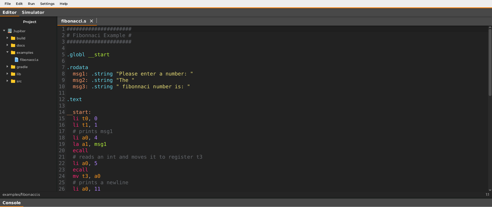
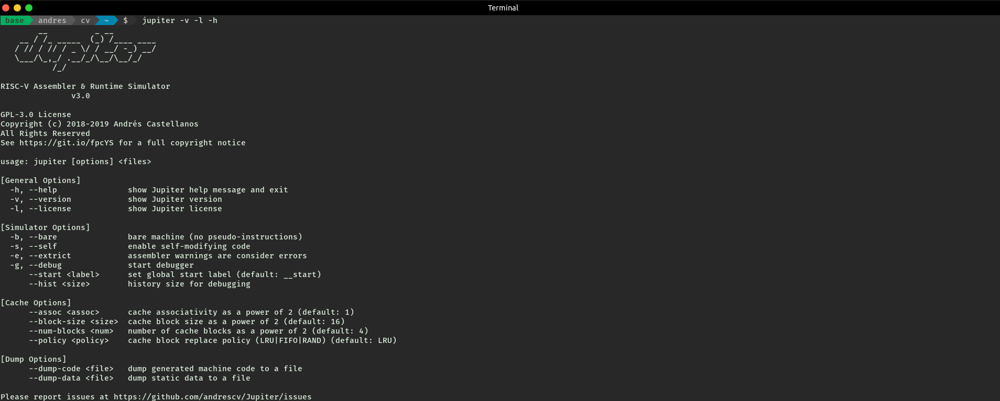

# Jupiter

**Jupiter** is an open source and education-oriented RISC-V assembler and runtime simulator. It is written in Java and capable of simulate all the instructions of the base integer ISA \(`I` extension\) plus the `M` and `F` extensions \(**RV32IMF**\), including all the pseudo-instructions described in the user-level instruction set manual. It was developed taking into account that it could be used in various courses such as: _Computer Architecture, Compilers and Assembly Programming_.

### Main Features

* **User Friendly**: Jupiter was designed focused on education and for all the people that are getting to know the RISC-V architecture. It places for priority the user experience. Jupiter has two modes of operation \(_Command Line Interface_ and _Graphical User Interface_\) and both of these were developed to be intuitive and easy to use.
* **Modularity**: Jupiter can assemble and simulate several files at once, not everything has to be one file of 1,000 lines of code. Simply indicate by a global label what is the main starting point of the program. This permits modularity and enables the creation of projects and laboratories more easily.
* **Feedback**: People using Jupiter gets feedback on what they are doing wrong. The simulator shows errors of: syntax, when trying to access reserved memory or when trying to write to a read-only memory.
* **Cross-platform**: Jupiter is available for **Linux** \(_Ubuntu_\), **macOS** and **Windows**.

### Screenshots

### Why this name, Jupiter ?

Traditionally other simulators of this type have used planet names, for example the famous educational simulator for the _MIPS_ architecture **MARS** or the Berkeley's web-based simulator **Venus**. The name **Jupiter** was chosen because of this traditional reasons and also because this planet represents in some sort the number **5** \(_is the fifth planet from the Sun and the largest in the Solar System\)_, in contrast with RISC-V that is the 5th generation of the ISA originally designed in the 90's.

